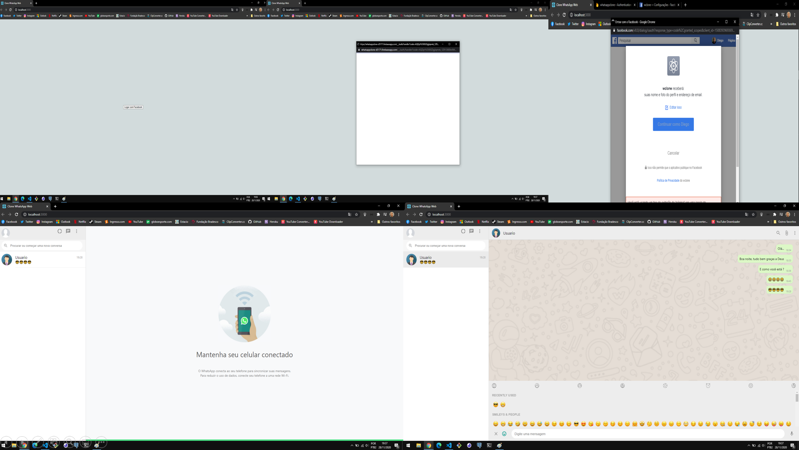

<h1 align="center">
  🐾 Clone do Whatsapp Web
</h1>

  <a href="#rocket-tecnologias">Tecnologias</a>&nbsp;&nbsp;&nbsp;|&nbsp;&nbsp;&nbsp;
  <a href="#-projeto">Projeto</a>&nbsp;&nbsp;&nbsp;|&nbsp;&nbsp;&nbsp;
  <a href="#-layout">Desenvolvimento</a>&nbsp;&nbsp;&nbsp;|&nbsp;&nbsp;&nbsp;

 

  

## 📛 Tecnologias

Esse projeto foi desenvolvido com as seguintes tecnologias:

- [React](https://reactjs.org)
- [Firebase](https://firebase.google.com/?hl=pt-br)

## 🏀 Projeto

O objetivo é clonar a página do Whatsapp Web junto com as telas de troca de mensagens, o chat de mensagens recentes ordenas da mais recentes e o teclado com o Emoji

## 💹 Desenvolvimento

- Estilização inicial da tela de conversas
- Esquema de cores na conversar baseado de quem enviou ou recebeu 
- Função de tela de converas
- Configuração do Firebase
- Login e senha pelo Facebook
- Tela de nova conversa
- Listagem de usuários no Chat
- Atualizando as mensagens e colocando como mais recente